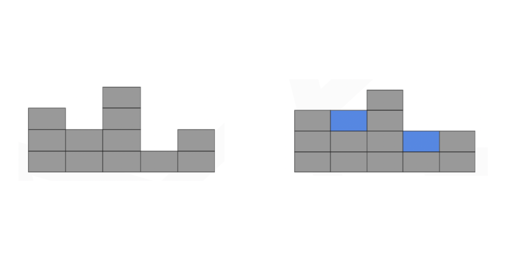

# Water Storage Calculator 🌧


This project is a solution for a tech recruitment task. It calculates the volume of water stored after a rainfall based on a given array representing the profile of a surface. The task involves implementing a REST server that exposes a single endpoint, which accepts an array as input and returns a number representing the volume of water stored after a rainfall over the surface represented by the given array.



## Technologies Used

This solution is created using the following technologies and tools:

- **Node.js**: A JavaScript runtime environment for running server-side applications.
- **TypeScript**: A statically typed superset of JavaScript that helps catch errors early in development.
- **Express**: A popular web application framework for Node.js.
- **Docker**: A containerization platform used to package the application and its dependencies.
- **GitHub Actions**: Continuous Integration/Continuous Deployment (CI/CD) workflows have been created to automate testing on branches and pull requests. Production releases are automatically pushed to private Docker Hub repository from the master branch.
- **Joi**: A library for input validation, used to validate API requests.
- **Jest**: A JavaScript testing framework used for unit and integration testing.

## Setting Up and Running the Project

Before you can run this project locally, ensure you have the [npm](https://www.npmjs.com/) package manager installed on your system.

### Clone the Repository

First, clone the repository to your local machine:

```bash
git clone https://github.com/filipciesielski7/WaterStorageCalculator.git
cd WaterStorageCalculator
```

### Install Dependencies

Install the project dependencies by running the following command:

```bash
npm install
```

### Usage Commands

Execute the following commands for project operations:

```bash
# Running in Development
npm run dev

# Running in Production
npm run start

# Testing
npm run test

# Building
npm run build
```

## Running the Project with Docker

Alternatively, you can use Docker to run the project in an isolated containerized environment. Here are the Docker commands:

```bash
# Running in Development
npm run docker:dev

# Running in Production
npm run docker:prod

# Testing
npm run docker:test
```

## Usage

After running the server, you can utilize it by sending a POST request to a specific URL with a request body containing an array that represents the surface profile. The server will process the request and provide you with the calculated result.

Please note that negative numbers in the surface profile array are also supported. They represent depressions or below-ground surfaces.

Here's an example of how to use the API:

- **HTTP Method**: POST
- **URL**: `http://localhost:4000/rainfall/volume`
- **Request Body**:
  ```json
  {
    "surface": [3, 2, 4, 1, 2]
  }
  ```

Upon sending the request, the server will respond with the calculated volume of water stored after the rainfall event for the provided surface profile. The result will be in the following format:

**Response Body**:

```json
{
  "result": 2
}
```

## Project Structure

```
src\
 |--controllers\    # Route controllers
 |--middlewares\    # Custom express middlewares
 |--routes\         # Routes
 |--tests\          # Jest tests
 |--utils\          # Utility classes and functions
 |--validations\    # Request data validation schemas
 |--app.js          # Express app
 |--index.js        # App entry point
```
